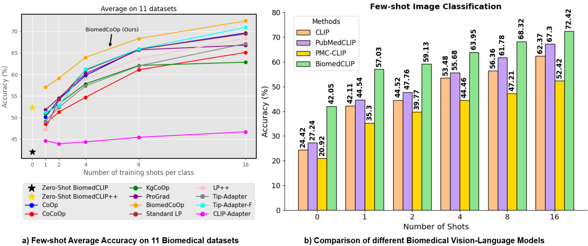
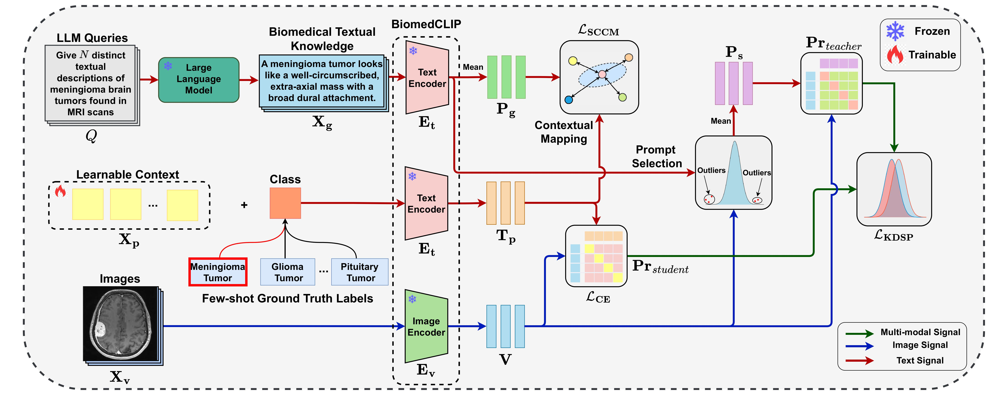

# BiomedCoOp: Learning to Prompt for Biomedical Vision-Language Models
**[Health-X Lab](http://www.healthx-lab.ca/)** | **[IMPACT Lab](https://users.encs.concordia.ca/~impact/)** 

[Taha Koleilat](https://tahakoleilat.github.io/), [Hojat Asgariandehkordi](https://scholar.google.com/citations?user=ndXNye4AAAAJ&hl=en), [Hassan Rivaz](https://users.encs.concordia.ca/~hrivaz/), [Yiming Xiao](https://yimingxiao.weebly.com/curriculum-vitae.html)

[](https://arxiv.org/abs/2411.15232)
[](#overview)
[](https://huggingface.co/datasets/TahaKoleilat/BiomedCoOp)
[](https://huggingface.co/TahaKoleilat/BiomedCoOp)
[](#citation)

## Overview


> **<p align="justify"> Abstract:** *Recent advancements in vision-language models (VLMs), such as CLIP, have demonstrated substantial success in self-supervised representation learning for vision tasks. However, effectively adapting VLMs to downstream applications remains challenging, as their accuracy often depends on time-intensive and expertise-demanding prompt engineering, while full model fine-tuning is costly. This is particularly true for biomedical images, which, unlike natural images, typically suffer from limited annotated datasets, unintuitive image contrasts, and nuanced visual features. Recent prompt learning techniques, such as Context Optimization (CoOp) intend to tackle these issues, but still fall short in generalizability. Meanwhile, explorations in prompt learning for biomedical image analysis are still highly limited. In this work, we propose BiomedCoOp, a novel prompt learning framework that enables efficient adaptation of BiomedCLIP for accurate and highly generalizable few-shot biomedical image classification. Our approach achieves effective prompt context learning by leveraging semantic consistency with average prompt ensembles from Large Language Models (LLMs) and knowledge distillation with a statistics-based prompt selection strategy. We conducted comprehensive validation of our proposed framework on 11 medical datasets across 9 modalities and 10 organs against existing state-of-the-art methods, demonstrating significant improvements in both accuracy and generalizability.* </p>

## Method

<p float="left">
  
</p>

1) **Semantic Consistency with LLM-Enhanced Prompt Ensembles**: Enhance context vector learning using prompt ensembles derived from GPT-4, combined with a knowledge distillation strategy to enforce semantic consistency.
2) **Outlier Pruning for Robust Generalization**: Employ a statistics-based pruning strategy to filter outlier prompts from LLMs, mitigating over-specialization and preserving essential biomedical patterns.
3) **First Adoption of BiomedCLIP for Prompt Learning**: Leverage BiomedCLIP for prompt learning for the first time, demonstrating superior performance over general knowledge CLIP in clinical tasks.
4) **Extensive Multi-Modal Evaluation**: Evaluate across 11 biomedical image classification datasets, 9 modalities, and 10 organs, showcasing BiomedCoOp's superior generalizability and robustness in few-shot and base-to-novel benchmarks.

## :ballot_box_with_check: Supported Methods

| Method                    | Paper                                         |                             Configs                             |          Training Scripts          | Trainers   |
|---------------------------|:----------------------------------------------|:---------------------------------------------------------------:|:----------------------------------:|:----------:|
| BiomedCoOp                 | [CVPR 2025](https://arxiv.org/abs/2411.15232)       | [link](configs/trainers/BiomedCoOp)                             | [link](scripts/biomedcoop)        | [link](trainers/BiomedCoOp) |
| CLIP                       | [ICML 2021](https://arxiv.org/abs/2103.00020) | [link](configs/trainers/Zeroshot)                               | [link](scripts/zeroshot)          | [link](trainers/Zeroshot)        |
| CoOp                        | [IJCV 2022](https://arxiv.org/abs/2109.01134) | [link](configs/trainers/CoOp)                                   | [link](scripts/coop)             | [link](trainers/CoOp)        |
| CoCoOp                      | [CVPR 2022](https://arxiv.org/abs/2203.05557) | [link](configs/trainers/CoCoOp)                                 | [link](scripts/cocoop)           | [link](trainers/CoCoOp)      |
| KgCoOp                      | [CVPR 2023](https://arxiv.org/abs/2303.13283) | [link](configs/trainers/KgCoOp)                                 | [link](scripts/kgcoop)           | [link](trainers/KgCoOp)      |
| ProGrad                     | [ICCV 2023](https://arxiv.org/abs/2205.14865) | [link](configs/trainers/ProGrad)                                | [link](scripts/prograd)          | [link](trainers/ProGrad)     |
| CLIP-Adapter                | [IJCV 2024](https://arxiv.org/abs/2110.04544) | [link](configs/trainers/CLIP_Adapter)                            | [link](scripts/clip_adapter)     | [link](trainers/ClipAdapter)|
| Tip-Adapter                 | [ECCV 2022](https://arxiv.org/abs/2111.03930) | [link](configs/trainers/TiP_Adapter)                             | [link](scripts/tip_adapter)      | [link](trainers/TipAdapter) |
| LP                          | [ICML 2021](https://arxiv.org/abs/2103.00020) | [link](configs/trainers/LP)                                     | [link](scripts/linear_probe)     | [link](trainers/LP)          |
| LP++                        | [CVPR 2024](https://arxiv.org/abs/2404.02285) | [link](configs/trainers/LP2)                                    | [link](scripts/linear_probe2)    | [link](trainers/LP2)         |

<hr />

## Results
Results reported below show accuracy for few-shot scenarios as well as base and novel classes across 11 biomedical recognition datasets averaged over 3 seeds.
### Few-shot Evaluation
| **Method**             | $K=1$ | $K=2$ | $K=4$ | $K=8$ | $K=16$ |
|-------------------------|:-------:|:-------:|:-------:|:-------:|:-------:|
| [CLIP-Adapter](https://arxiv.org/abs/2110.04544)           |  44.66  |  43.91  |  44.36  |  45.42  |  46.69  |
| [Tip-Adapter](https://arxiv.org/abs/2111.03930)            |  49.19  |  52.36  |  57.33  |  61.98  |  67.15  |
| [Tip-Adapter-F](https://arxiv.org/abs/2111.03930)          |  51.17  |  52.74  |  61.23  |  65.91  |  70.91  |
| [Standard LP](https://arxiv.org/abs/2103.00020)           |  47.25  |  54.21  |  61.00  |  65.85  |  69.40  |
| [LP++](https://arxiv.org/abs/2404.02285)                   |  47.24  |  53.18  |  59.02  |  63.69  |  68.35  |
| [CoOp](https://arxiv.org/abs/2109.01134)                  |  50.16  |  54.18  |  59.75  |  65.84  |  69.62  |
| [CoCoOp](https://arxiv.org/abs/2203.05557)                |  48.49  |  51.28  |  54.69  |  61.08  |  65.09  |
| [KgCoOp](https://arxiv.org/abs/2303.13283)                |  50.85  |  53.18  |  57.82  |  62.08  |  62.84  |
| [ProGrad](https://arxiv.org/abs/2205.14865)               |  51.88  |  54.71  |  60.42  |  65.61  |  67.13  |
| [**BiomedCoOp**](https://arxiv.org/abs/2411.15232)  | **57.03** | **59.13** | **63.95** | **68.32** | **72.42** |
### Base-to-Novel Generalization
| Name                                                      | Base Acc. | Novel Acc. |    HM     |  
|-----------------------------------------------------------|:---------:|:----------:|:---------:|  
| [BiomedCLIP](https://arxiv.org/abs/2303.00915)            |   47.84   |   65.42    |   53.81   |  
| [CoOp](https://arxiv.org/abs/2109.01134)                  |   73.85   |   64.75    |   67.23   |  
| [CoCoOp](https://arxiv.org/abs/2203.05557)                |   72.26   |   67.03    |   67.22   |  
| [KgCoOp](https://arxiv.org/abs/2303.13283)                |   68.36   |   64.08    |   64.61   |  
| [ProGrad](https://arxiv.org/abs/2205.14865)               |   71.67   |   66.93    |   67.43   |  
| [**BiomedCoOp (ours)**](https://arxiv.org/abs/2411.15232) |   **76.26**   | **73.92**  | **75.07** |  

## Model Checkpoints and Logs
| Name                                                      | Few-Shot | Base-to-Novel |  
|-----------------------------------------------------------|:---------:|:----------:| 
| [**BiomedCoOp**](https://github.com/HealthX-Lab/BiomedCoOp/blob/main/trainers/BiomedCoOp/biomedcoop_biomedclip.py) |  [link](https://huggingface.co/TahaKoleilat/BiomedCoOp/tree/main/few_shot)  | [link](https://huggingface.co/TahaKoleilat/BiomedCoOp/tree/main/base2new) |

## Installation 
For installation and other package requirements, please follow the instructions detailed in [INSTALL.md](assets/INSTALL.md). 

## Data preparation
Please follow the instructions at [DATASETS.md](assets/DATASETS.md) to prepare all datasets.

## Training and Evaluation
Please refer to the [RUN.md](assets/RUN.md) for detailed instructions on training, evaluating and reproducing the results using our pre-trained models.

<hr />

## Citation
If you use our work, please consider citing:
```bibtex
@inproceedings{koleilat2025biomedcoop,
  title={Biomedcoop: Learning to prompt for biomedical vision-language models},
  author={Koleilat, Taha and Asgariandehkordi, Hojat and Rivaz, Hassan and Xiao, Yiming},
  booktitle={Proceedings of the Computer Vision and Pattern Recognition Conference},
  pages={14766--14776},
  year={2025}
}
```

## Acknowledgements

Our code builds upon the [CoOp](https://github.com/KaiyangZhou/CoOp), [MaPLe](https://github.com/muzairkhattak/multimodal-prompt-learning), and [LP++](https://github.com/FereshteShakeri/FewShot-CLIP-Strong-Baseline) repositories. We are grateful to the authors for making their code publicly available. If you use our model or code, we kindly request that you also consider citing these foundational works.
